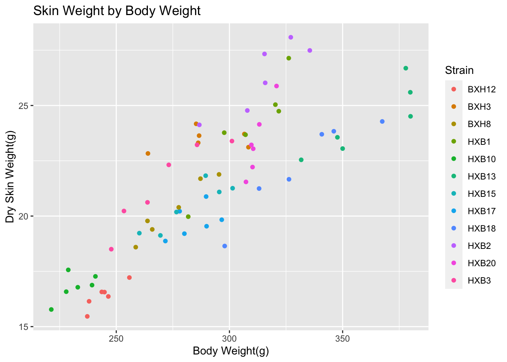
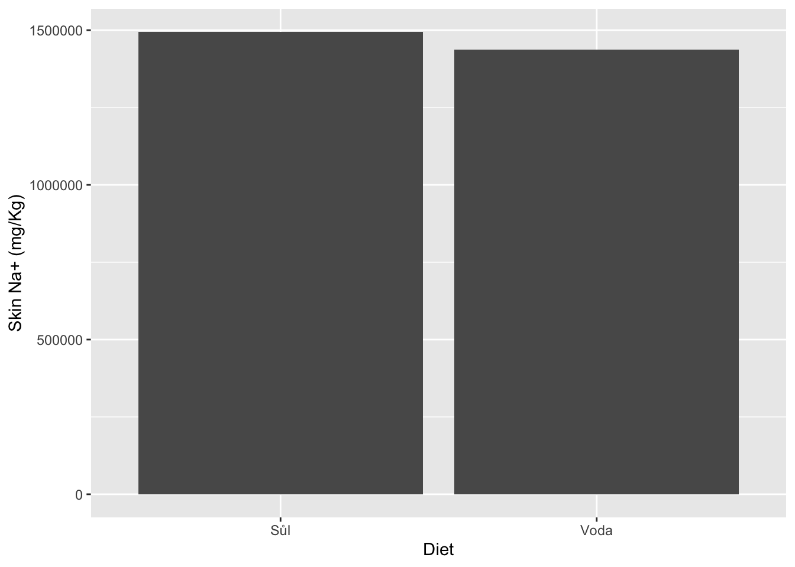

# Data Visualization of RI Skin Data

## by Kaleb Negussie

### Saba Lab

**Part 1**


```r
df <- read.csv('/Users/kalebnegussie/Desktop/RI data/Skin.Data.csv')
df %>% ggplot(aes(Body.Weight..g.,Skin.Dry.Weight..g.))+ 
      geom_point(aes(col = Strain))+
      ylab('Dry Skin Weight(g)')+
      xlab('Body Weight(g)')+
      ggtitle('Skin Weight by Body Weight')
```



**Part 2**


```r
sd <- df %>% group_by(Strain, Diet) %>%  summarize(mean(Na...mg.kg.))
```

```
## `summarise()` has grouped output by 'Strain'. You can override using the
## `.groups` argument.
```

```r
sd <- rename(sd, 'Na' = 'mean(Na...mg.kg.)')
sd_plot <- sd %>% ggplot(aes(x = Diet, y = Na)) +
  geom_bar(stat = "identity")+
  ylab('Skin Na+ (mg/Kg)')
  ggtitle('Skin Na+ Concentration by Diet')
```

```
## $title
## [1] "Skin Na+ Concentration by Diet"
## 
## attr(,"class")
## [1] "labels"
```

```r
sd_plot
```



**Part 3**


```r
ed <- df %>% group_by(Diet , Strain) %>%  summarize(mean(Na...mg.kg.), 
                                             mean(Cl...mg.kg.),
                                             mean(K...mg.kg.))
```

```
## `summarise()` has grouped output by 'Diet'. You can override using the
## `.groups` argument.
```

```r
ed$X <- c(1:12, 1:12)
ed_plot_data <- data.frame(Diet = ed$Diet, 
                           X = ed$X,
                           Electrolytes = c(ed$`mean(Na...mg.kg.)`,
                                            ed$`mean(Cl...mg.kg.)`,
                                            ed$`mean(K...mg.kg.)`),
                           Group = c(rep('Na_salt', 12),
                                     rep('Na_water',12),
                                     rep('Cl_salt',12),
                                     rep('Cl_water',12),
                                     rep('K_salt',12),
                                     rep('K_water',12)))
```
